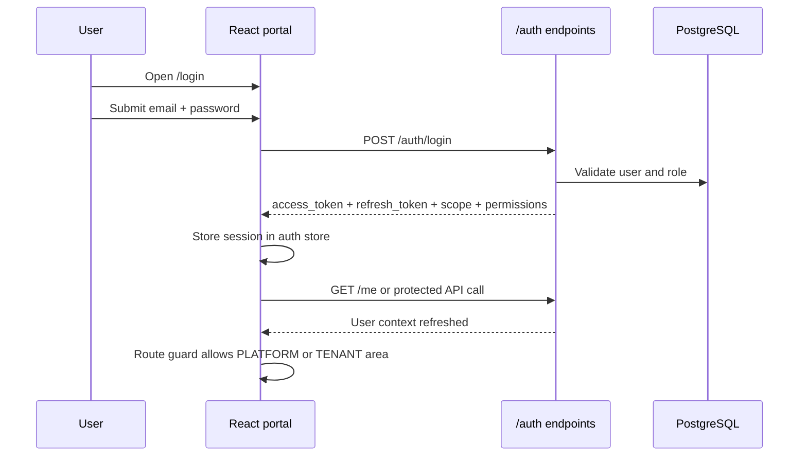
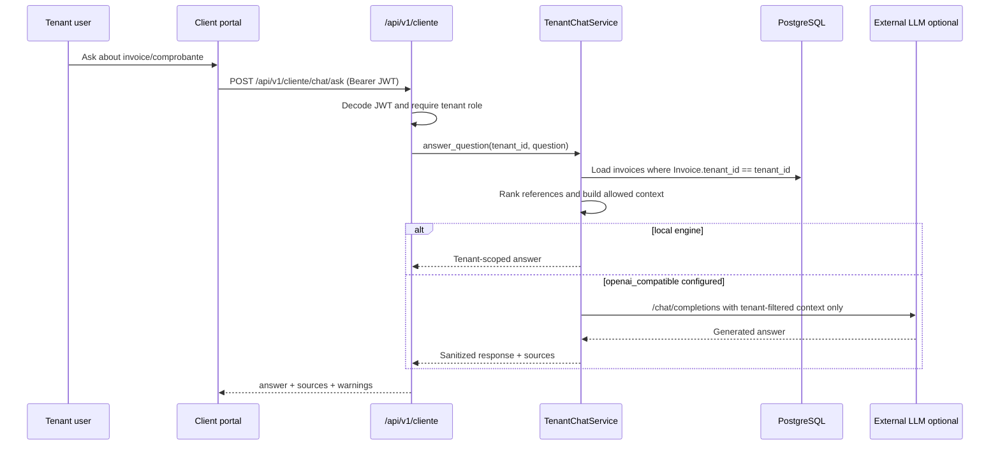
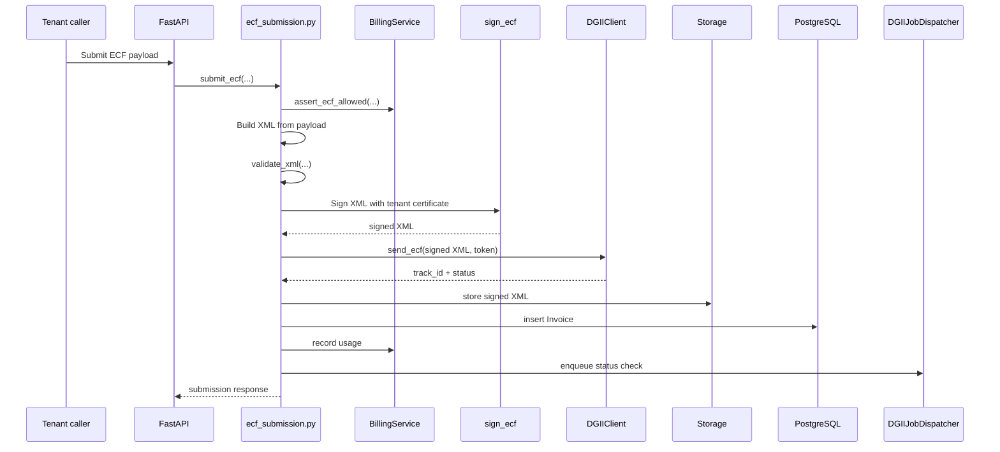
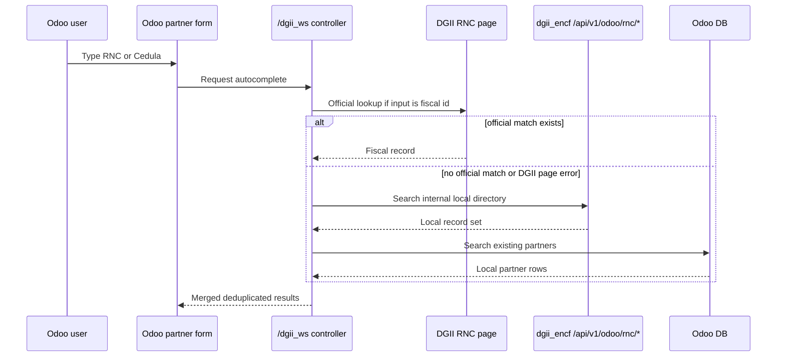

# Project Architecture And Service Flows - 2026-03-18

## Purpose

This document describes the architecture that is actually visible in the repository today, then contrasts it with the intended target shape already described in `docs/guide/15-implementacion-aws.md` and `docs/guide/16-arquitectura-eks.md`.

It is intentionally split into:

- current code-backed architecture
- current runtime/service flows
- target integration shape
- implementation gaps

## 1. Current code-backed architecture

### 1.1 System view

```mermaid
flowchart LR
    subgraph Users
        A1[Platform user]
        A2[Tenant user]
        A3[Odoo operator]
    end

    subgraph Frontend
        F1[Admin Portal React/Vite]
        F2[Client Portal React/Vite]
    end

    subgraph Backend["FastAPI monolith in app/"]
        B1[Portal Auth]
        B2[Admin Router]
        B3[Client Router]
        B4[DGII submission services]
        B5[Tenant chat service]
        B6[Local Odoo RNC endpoints]
        B7[Metrics and readiness]
    end

    subgraph Data
        D1[(PostgreSQL)]
        D2[(Redis)]
        D3[Local storage/XML files]
        D4[Local RNC catalog JSON]
    end

    subgraph Odoo
        O1[getupsoft_do_localization]
        O2[res.partner autocomplete]
    end

    subgraph External
        E1[DGII e-CF APIs]
        E2[DGII RNC public page]
        E3[DGII service status API]
        E4[AWS Route53/IAM/CLI]
        E5[Sentry optional]
        E6[OpenAI-compatible LLM optional]
    end

    A1 --> F1
    A2 --> F2
    A3 --> O1

    F1 --> B1
    F1 --> B2
    F2 --> B1
    F2 --> B3
    F2 --> B5

    B2 --> D1
    B3 --> D1
    B4 --> D1
    B4 --> D3
    B5 --> D1
    B6 --> D4
    B7 --> D1
    B7 --> D2

    B4 --> E1
    B6 --> E2
    B4 -.optional health awareness.-> E3
    O2 --> E2
    O2 --> B6
    B1 -.optional.-> E5
    B5 -.optional.-> E6
```

### 1.2 Main backend modules

- `app/main.py`: app assembly, middleware, metrics, health, router registration.
- `app/api/routes/auth.py`: login, MFA verification, `/me`, token issuance, platform vs tenant scope.
- `app/routers/admin.py`: tenant administration, plans, audit, accounting summaries.
- `app/routers/cliente.py`: tenant self-service, invoices, plans, usage, chatbot.
- `app/application/ecf_submission.py`: XML validation, digital signature, DGII submission, persistence, usage billing trigger.
- `app/dgii/client.py`: semilla -> signed semilla -> token -> DGII endpoints, retries, idempotency cache, status/result queries.
- `app/routers/odoo.py`: local endpoints used by Odoo autocomplete fallback.
- `app/application/tenant_chat.py`: tenant-only invoice question answering with local or external LLM engine.

### 1.3 Main frontend modules

#### Admin portal

- Route root guarded by `RequireAuth` + `RequireScope scope="PLATFORM"`.
- Main areas:
  - dashboard
  - companies
  - plans
  - audit logs
  - platform users

#### Client portal

- Route root guarded by `RequireAuth` + `RequireScope scope="TENANT"`.
- Main areas:
  - dashboard
  - invoices
  - plans
  - assistant
  - emit e-CF
  - emit RFCE
  - approvals
  - certificates
  - profile

## 2. Service flows

### 2.1 Authentication and portal access flow

### 2.2 Tenant invoice query and chatbot flow

### 2.3 e-CF emission flow in current backend

### 2.4 Odoo partner autocomplete flow

## 3. Current architecture observations

### 3.1 What is already coherent

- Auth, platform routes, tenant routes, and local Odoo support are mounted in one API entrypoint.
- Tenant isolation is explicit in the client portal and chatbot flows.
- DGII interaction is centralized in a dedicated client and submission service rather than spread across routers.
- Odoo integration is being isolated under `integration/odoo/` instead of mixing addon code into the FastAPI app tree.

### 3.2 What is still transitional

- The repo is still closer to a modular monolith than to the microservice target described in the AWS/EKS documents.
- The frontend source and compiled `dist` assets are not guaranteed to be synchronized on this host.
- The future `odoo_integration` bridge is documented but not implemented as a runtime service.
- Some pages in the client portal remain simulated UI shells instead of full backend-backed features.

## 4. Target architecture already implied by repo docs

The target state described in `docs/guide/15-implementacion-aws.md` and `docs/guide/16-arquitectura-eks.md` points toward:

- decomposed services (`auth_service`, `billing_service`, `dgii_client`, `sign_service`, optional `odoo_integration`)
- AWS-managed secrets and IAM separation
- object storage for XML/RI
- stronger observability and deployment controls
- environment separation across staging/production

That target is reasonable, but the current codebase has not fully crossed that line yet.

## 5. Clean architecture gaps to address next

1. Implement the real `odoo_integration` bridge and choose Odoo transport:
   - prefer Odoo 19 replacement path planning now because XML-RPC/JSON-RPC classic endpoints are scheduled for removal in Odoo 20
   - avoid building new integration debt on top of deprecated endpoints
2. Remove duplicated frontend source variants (`.ts/.tsx` and emitted `.js`) from the editable source tree or define a single source-of-truth policy.
3. Rebuild portals from source in a reproducible Node toolchain and publish fresh `dist` bundles.
4. Add a first-class service flow for DGII status-service consultation and contingency handling.
5. Add runtime verification against:
   - real Odoo 19 instance
   - DGII `CERT` with valid emitter certificate
   - production-like AWS IAM and DNS update flow

## 6. Official references used for external-facing architecture decisions

- DGII e-CF documentation hub:
  - `https://dgii.gov.do/cicloContribuyente/facturacion/comprobantesFiscalesElectronicosE-CF/Paginas/documentacionSobreE-CF.aspx`
- DGII public RNC consultation:
  - `https://dgii.gov.do/app/WebApps/ConsultasWeb2/ConsultasWeb/consultas/rnc.aspx`
- Odoo 19 external RPC API:
  - `https://www.odoo.com/documentation/19.0/developer/reference/external_rpc_api.html`
- Odoo 19 module manifest reference:
  - `https://www.odoo.com/documentation/19.0/developer/reference/backend/module.html`
- Odoo 19 `invisible` attribute reference:
  - `https://www.odoo.com/documentation/19.0/developer/reference/user_interface/view_architectures/generic_attribute_invisible.html`
- AWS IAM best practices:
  - `https://docs.aws.amazon.com/IAM/latest/UserGuide/best-practices.html`
- AWS temporary credentials:
  - `https://docs.aws.amazon.com/IAM/latest/UserGuide/id_credentials_temp.html`
- AWS Route53 change record sets:
  - `https://docs.aws.amazon.com/Route53/latest/APIReference/API_ChangeResourceRecordSets.html`
- AWS CLI config files:
  - `https://docs.aws.amazon.com/cli/latest/userguide/cli-configure-files.html`
