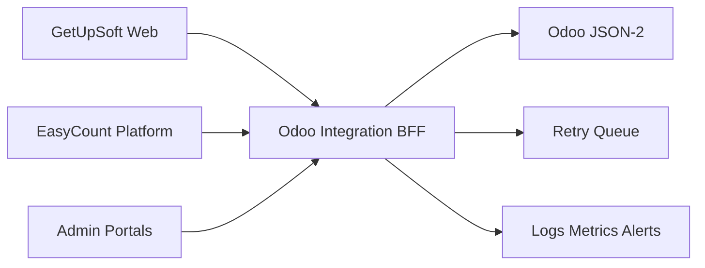

# Final Blueprint

## Repositories

- `getupsoft-web`: corporate web.
- `easycount-platform`: product app.
- `getupsoft-odoo-integration`: BFF/API gateway.
- `getupsoft-admin-portals`: administrative surfaces.
- `getupsoft-infra`: DNS, CI/CD, tunnels, observability, and environment automation.

## Runtime Flow

## Environments

| Environment | Corporate | Product | Admin | API |
| --- | --- | --- | --- | --- |
| Production global | `getupsoft.com` | `easycount.getupsoft.com` | `admin.getupsoft.com` | `api.getupsoft.com` |
| Production RD | `getupsoft.com.do` | `easycount.getupsoft.com.do` | `admin.getupsoft.com.do` | shared BFF |
| Staging | `stg.getupsoft.com.do` | staging path/subdomain | staging admin host/path | staging BFF |

## Deployment Host

Deploy GetUpSoft/EasyCount to `ssh.getupsoft.com.do` only under `/srv/getupsoft/*`. Use unique Docker Compose project names and localhost-only ports defined in `docs/getupsoft-easycount/deployment-isolation.md` so existing projects on the server are not affected.

Preflight on 2026-05-09 confirmed many existing Docker projects on this host, including `galantes-staging`, `server` for `/opt/EasyCounting`, `mailcowdockerized`, `supabase`, `n8n`, `calcom`, and observability services. Port `3100` was already in use, so GetUpSoft web production uses `127.0.0.1:3120`.

The corporate portal is no longer a planned placeholder. It is already live in the current environment footprint, with `getupsoft.com.do` verified from this workspace as an active corporate page.

## Release Gates

- ADRs approved.
- CI passing.
- Secrets configured.
- Cloudflare routes verified.
- Smoke tests passing.
- Rollback target recorded.
