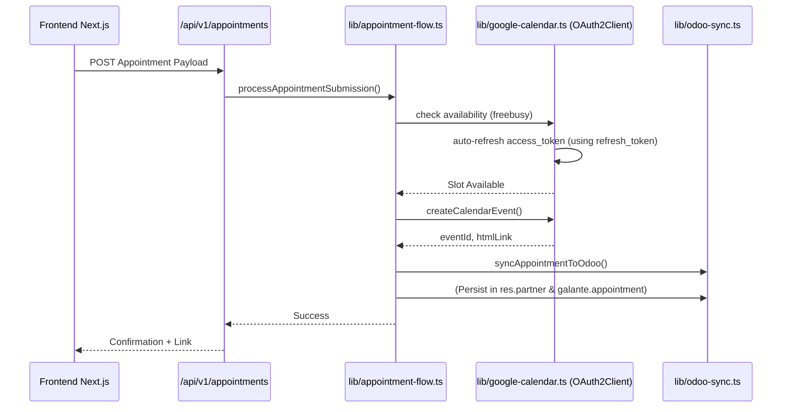

# Google Calendar OAuth Flow Map
Este documento sirve como memoria a largo plazo para entender el flujo de integración de Google Calendar en Galante's Jewelry.

## 1. Arquitectura de Doble Capa
El proyecto mantiene dos sistemas paralelos para el manejo de OAuth, lo que puede causar confusión si no se mapea correctamente:

| Sistema | Ruta Principal | Almacenamiento | Propósito |
| :--- | :--- | :--- | :--- |
| **Modern (Production)** | `app/api/admin/google/oauth` | Odoo (Cifrado) + `integrations.json` | Gestión administrativa, multi-entorno (dev/staging/prod). |
| **Legacy (Utility)** | `services/calendarService.js` | `token.json` (Local) | Scripts legacy, utilerías de servidor y servicios de fondo simples. |

## 2. Flujo de OAuth (Administrador)
Este flujo permite conectar la cuenta "Owner" que gestiona el calendario de citas.

### Paso 1: Iniciación
- **Endpoint**: `GET /api/admin/google/oauth/start?environment=production`
- **Lógica**:
  1. Verifica sesión de admin.
  2. Carga configuración cifrada desde Odoo vía `lib/integrations.ts`.
  3. Genera una URL de Google con `access_type=offline` y `prompt=consent` para garantizar la recepción del `refresh_token`.
  4. Establece cookies de estado (`admin_google_connect_state`).

### Paso 2: Callback y Persistencia
- **Endpoint**: `GET /api/admin/google/oauth/callback`
- **Lógica**:
  1. Valida el `state` contra la cookie.
  2. Intercambia el `code` por tokens (`access_token`, `refresh_token`).
  3. **Persistencia Crucial**: Llama a `storeGoogleOAuthTokens` en `lib/integrations.ts`.
     - Cifra los tokens usando AES.
     - Sincroniza el snapshot completo con **Odoo** (`syncIntegrationsSnapshotToOdoo`).
     - Actualiza el archivo local `integrations.json`.

## 3. Flujo de Creación de Citas (Cliente)
Cuando un cliente reserva en la web:

## 4. El "Challenge" de OAuth (Puntos de Falla)
- **Invalid Grant**: Si el `refresh_token` es revocado (ej. cambio de password), el sistema lanzará un error 401. Se debe re-conectar desde el Admin Panel.
- **Redirect URI Mismatch**: El URI debe ser exacto (incluyendo `https` y subdominio) tanto en el código como en la Google Cloud Console.
- **Falta de Refresh Token**: Solo se envía el `refresh_token` en el *primer* consentimiento. Si se pierde `token.json` o el registro en Odoo, el admin debe desvincular la app en Google Account Permissions antes de intentar reconectar para forzar un nuevo token.

## 5. Variables de Entorno Clave
- `CLIENT_ID` / `GOOGLE_OAUTH_CLIENT_ID`
- `CLIENT_SECRET` / `GOOGLE_OAUTH_CLIENT_SECRET`
- `GOOGLE_OAUTH_REDIRECT_URI`
- `GOOGLE_TOKEN_PATH` (Para el modo legacy)

## 6. Localización de Archivos Críticos
- 🔑 **Configs**: `lib/google-oauth.ts`, `config/googleAuth.js`
- 💾 **Persistencia**: `lib/integrations.ts`, `lib/odoo-cms-sync.ts`
- 📅 **Lógica de Citas**: `lib/appointment-flow.ts`, `lib/google-calendar.ts`, `services/calendarService.js`
