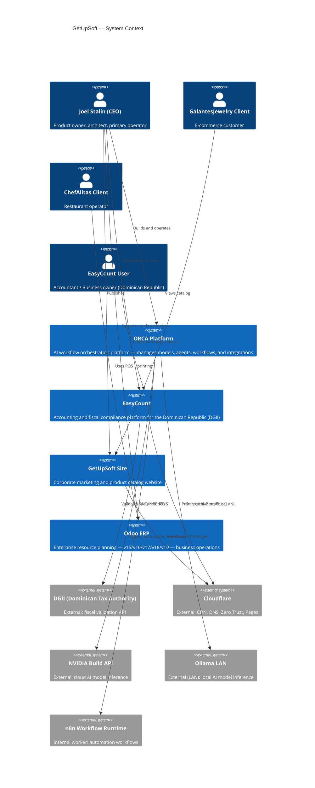
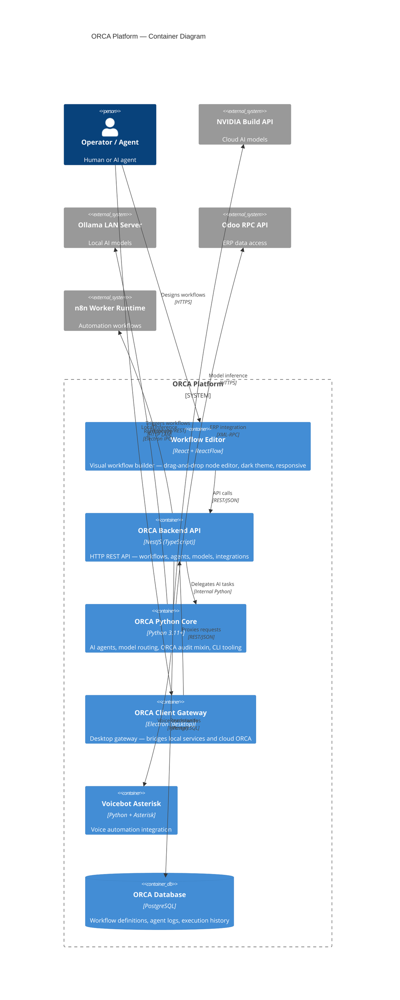
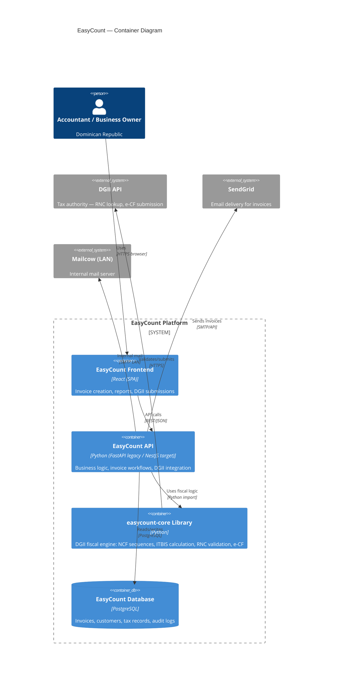
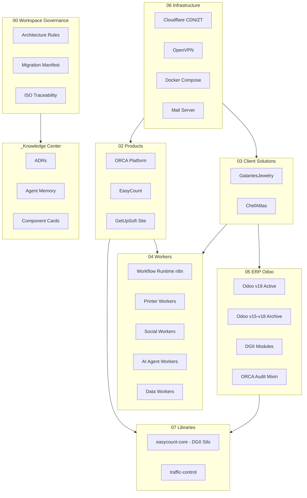
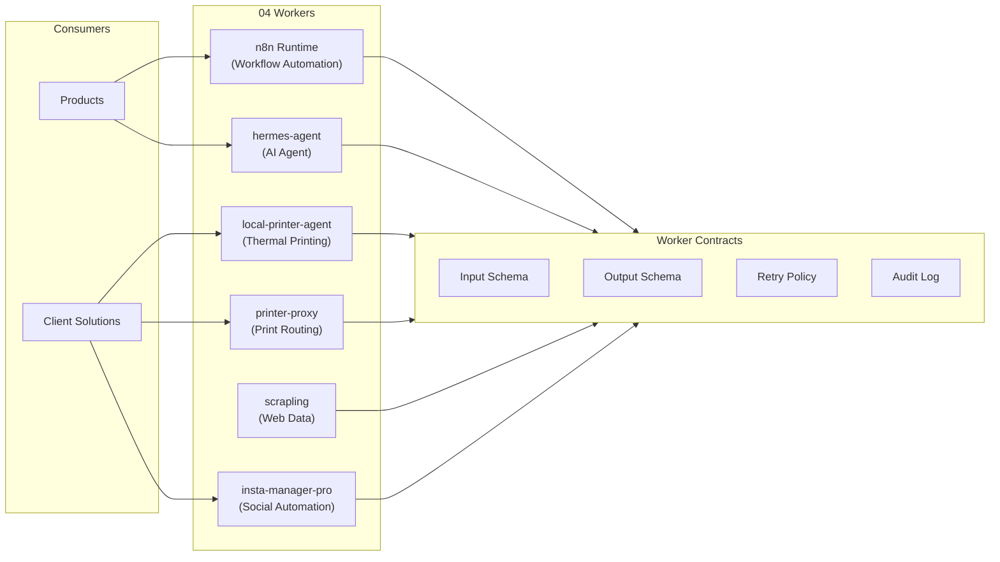
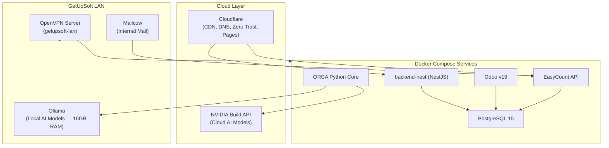

# Architecture Overview — GetUpSoft Workspace

**Document ID:** ARCH-001
**Date:** 2026-05-31
**Owner:** Joel Stalin Martinez Espinal
**Status:** Active
**ISO Reference:** ISO/IEC/IEEE 42010:2011 — Architecture Description

---

## C4 Level 1 — System Context Diagram

---

## C4 Level 2 — Container Diagram: ORCA Platform

---

## C4 Level 2 — Container Diagram: EasyCount

---

## Domain View

---

## Workers View

---

## Infrastructure View

---

## Quality Attribute Summary (ISO 25010:2023)

| Quality Attribute | Implementation Evidence |
|---|---|
| Functional Suitability | EasyCount DGII modules, ORCA workflow engine, Odoo customizations |
| Performance Efficiency | Load tests (oo-021), ORCA model routing (cloud vs local), n8n async |
| Compatibility | NestJS REST API, ORCA XML-RPC Odoo bridge, n8n webhook integration |
| Interaction Capability | WCAG AA accessibility (ORCA Workflow Editor), keyboard navigation, ARIA |
| Reliability | SSH recovery guide, container remediation, ORCA retry patterns |
| Security | .gitignore secrets, Zero Trust (Cloudflare), ORCA audit mixin, access control |
| Maintainability | Worker-First architecture, ADRs, domain isolation, hexagonal patterns |
| Flexibility | Docker Compose, model-agnostic ORCA, Hexagonal/Clean architecture |

---

*Generated: 2026-05-31 | GetUpSoft Architecture Overview*
